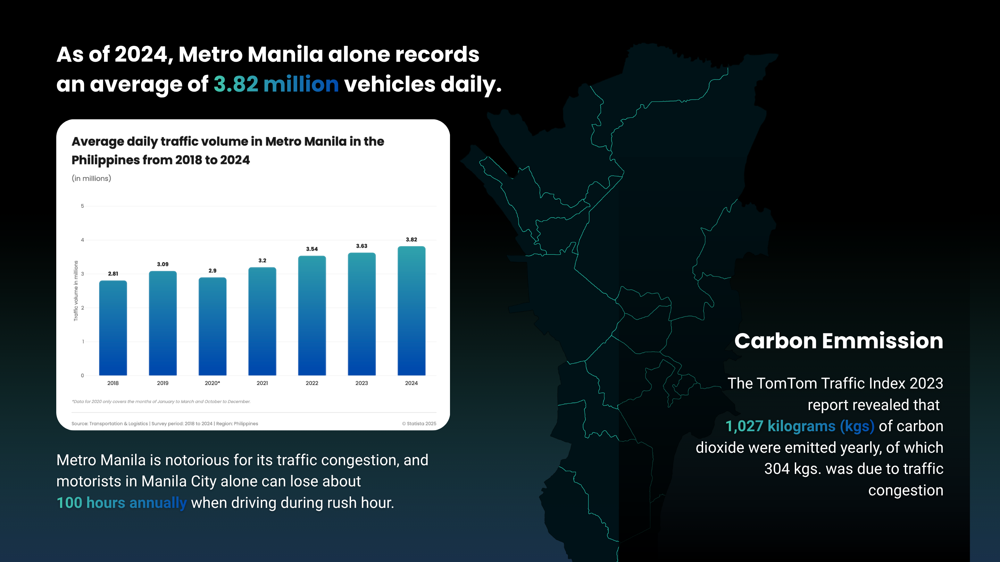
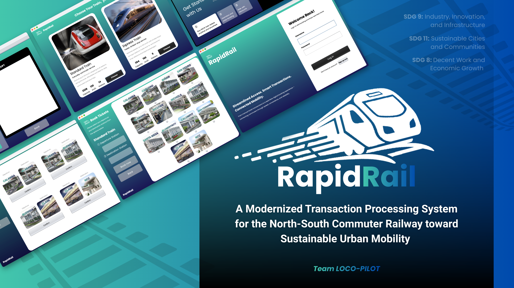
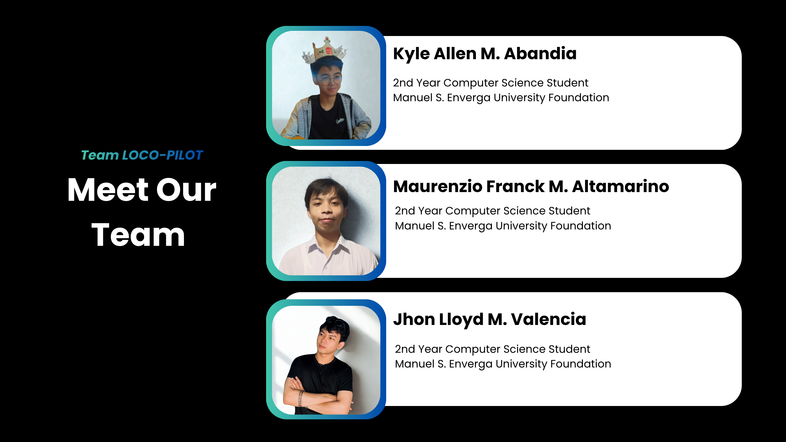

<div align="center">

# RapidRail


**A Modernized Transaction Processing System for the North-South Commuter Railway toward Sustainable Urban Mobility**
<div align="center"></div>

[](#)
[](#)
[](#)
[](#)
[](#)

*Cutting queues. Cutting congestion. One booking at a time.*

**Kyle Allen Abandia · Maurenzio Franck Altamarino · Jhon Lloyd Valencia**
Manuel S. Enverga University Foundation — 2nd Year Computer Science

</div>

---

## Table of Contents

1. [Pitch Deck](#pitch-deck)
2. [The Problem](#the-problem)
3. [What is RapidRail?](#what-is-rapidrail)
4. [User Personas](#user-personas)
5. [Core Features](#core-features)
6. [System Flow](#system-flow)
7. [OOP Principles](#oop-principles)
8. [SDG Alignment](#sdg-alignment)
9. [Meet the Team](#meet-the-team)
10. [References](#references)

---

## Pitch Deck

[View RapidRail Pitch Deck (PDF)](RapidRail_PitchDeck.pdf)

---

## The Problem

<div align="center"></div>

Metro Manila is one of the most congested cities in the world. The numbers paint a grim picture:

- **3.82 million vehicles** on Metro Manila roads daily as of 2024
- Motorists in Manila City alone lose **~100 hours per year** during rush hour
- **1,027 kg of CO₂** emitted per driver annually — 304 kg of that directly caused by traffic congestion
- Metro Manila ranks **worst in traffic congestion** among 387 cities across 55 countries (TomTom 2023)
- Average travel time for a **10 km route: 25 minutes and 30 seconds**
- Public commuters lose **117 hours (4 days and 21 hours)** per year to traffic
- The Philippines ranks **60th out of 65 economies** in Urban Mobility Readiness — 5th worst globally, and last in Asia Pacific

A JICA study estimates that if no effective intervention is made, the cost of traffic congestion could balloon from **₱3.5 billion/day to ₱5.4 billion/day by 2035** — or **₱1.97 trillion per year**.

---

## What is RapidRail?

<div align="center"></div>

RapidRail is a modernized transaction processing system designed for the **North-South Commuter Railway (NSCR)** — the Philippines' largest railway project connecting Clark, Pampanga to Calamba, Laguna across **147 km, 35 stations, and 58 trains**.

**Core objectives:**

- Give every rider **clear, step-by-step guidance** — from choosing a train to navigating stations with confidence
- Provide a **seamless digital experience** where commuters can plan trips, book tickets, and avoid long queues before leaving home
- Encourage more people to choose **efficient mass transport**, helping reduce traffic congestion and support sustainable urban mobility

---

## User Personas

### Sid Enocillas — The Regular Commuter
> *"I just want a system that's organized — something that respects my time."*

Sid takes the train almost every day because it's faster and cheaper than buses or jeepneys. His biggest pain point: unpredictable queues during rush hour that sometimes take longer than the actual ride.

### Mark Rivera — The First-Time Commuter
> *"If I could book everything online before I even leave home, the experience would be so much easier."*

Mark tried the train for the first time after friends recommended it. He felt lost — didn't know where to line up, what ticket to buy, or that he needed cash. He wants a system where everything can be prepared digitally before arriving at the station.

---

## Core Features

### 1. User Account System
- Register with full name, age, gender, citizenship, email, username, and password
- All data persisted to `railway.sql` database
- Secure login with session management

### 2. Train Type Selection
The NSCR operates **51 commuter trains**, **7 express trains**, and **35 stations**. RapidRail supports both modes:

| Type | Selection Method | Best For |
|---|---|---|
| **Commuter** | Choose specific departure & destination stations | Flexible, stop-by-stop travel |
| **Express** | Choose Northbound or Southbound fixed route | Faster, limited-stop travel |

### 3. Standard Train Booking
- Tap Departure Station or Destination Station to open the selection list
- System automatically identifies **Northbound or Southbound** direction based on chosen route
- Real-time seat availability displayed before confirmation

### 4. Express Train Booking
- No individual station selection needed
- Fixed **Northbound** or **Southbound** routes with predetermined stops
- Designed for faster boarding and reduced decision time

### 5. Transaction Menu
- Displays all trip details: train type, stations, date, schedule, remaining seats
- Optional add-ons and additional services
- Ticket pricing with **discount categories**: Student (20%), PWD (25%), Senior Citizen (20%)
- **Real-time clock** — tracks current time for accurate schedule matching

### 6. Receipt & Payment
- **Transparent fare**: ₱15 base fare displayed clearly before checkout
- **Payment methods**: GCash, Maya, BPI, BDO, Landbank, PayPal, Amex
- Receipt includes: Transaction ID, date/time, passenger info, journey details, add-ons, discount applied, and final price

### 7. Transaction History
- Full log of all past bookings tied to the user account
- Each record shows: Transaction ID, User ID, date, departure, destination, and ticket price

### 8. Kiosk Verification
The RapidRail Kiosk is the station's physical entry point:
1. Passenger enters their **Transaction ID** at the kiosk
2. System retrieves and validates the record
3. Trip is marked as **completed** upon successful verification
4. Passenger proceeds through the station and boards

> Fast, secure, and contactless ticket authentication — no physical ticket required.

---

## System Flow

```
App Launch
│
├── Login / Register
│     └── Account saved to railway.sql
│
├── Train Type Selection
│     ├── Commuter Train → Standard Booking
│     │     ├── Select Departure Station
│     │     ├── Select Destination Station
│     │     └── System detects: Northbound or Southbound
│     └── Express Train → Express Booking
│           ├── Select: Northbound
│           └── Select: Southbound
│
├── Transaction Menu
│     ├── Review: train type, stations, schedule, seats
│     ├── Select add-ons (optional)
│     ├── Apply discount: Student / PWD / Senior
│     └── Choose payment method → Pay Now
│
├── Receipt Generated
│     └── Transaction ID issued
│
└── Station Kiosk
      ├── Enter Transaction ID
      ├── System validates ticket
      ├── Trip marked as completed
      └── Passenger boards train
```

---

## OOP Principles

RapidRail is built on all four core Object-Oriented Programming principles:

| Principle | Application |
|---|---|
| **Encapsulation** | User data, booking details, and payment info are bundled into protected class structures |
| **Inheritance** | Commuter and Express train classes share a base Train class with shared booking logic |
| **Polymorphism** | Booking behavior adapts depending on whether the train is Commuter or Express |
| **Abstraction** | Complex database and payment operations are hidden behind simple method calls |

---

## SDG Alignment

<div align="center"></div>

| SDG | Goal | How RapidRail Contributes |
|---|---|---|
| **SDG 8** | Decent Work and Economic Growth | Reduces time lost to commuting, boosting worker productivity |
| **SDG 9** | Industry, Innovation, and Infrastructure | Modernizes rail transaction infrastructure with digital-first systems |
| **SDG 11** | Sustainable Cities and Communities | Encourages mass transit adoption, reducing traffic and carbon emissions |

---

## Meet the Team

<div align="center"></div>

**Team LOCO-PILOT** — 2nd Year Computer Science Students
Manuel S. Enverga University Foundation

| Member | Role |
|---|---|
| Kyle Allen M. Abandia | Developer |
| Maurenzio Franck M. Altamarino | Developer |
| Jhon Lloyd M. Valencia | Developer |

---

## References

- GMA Integrated News. (2025, January 16). *Davao City 8th, Manila 14th worst in TomTom Traffic Index.* GMA News.
- IBON Foundation. (2024, April). *Metro Manila traffic congestion report.* https://www.ibon.org/wp-content/uploads/2024/04/ts1-mmtc.pdf
- Japan International Cooperation Agency. (2018). *Estimate of Metro Manila's traffic congestion cost: PHP 3.5 billion/day in 2017, projected to PHP 5.4 billion/day by 2035.*
- Mira, R. P. (2025). *Full Speed Ahead: Revitalizing the Philippine Rail Transport System* (CPBRD Discussion Paper No. DP2025-06). Congressional Policy and Budget Research Department.
- OneNews.PH. (2024, January 14). *Traffic Index: 25 minutes, 30 seconds to travel 10 kilometers in Metro Manila.*
- Statista. (2025, March). *Philippines: average daily traffic Metro Manila.* https://www.statista.com/statistics/1276518/philippines-average-daily-traffic-metro-manila/

---

<div align="center">

Built for Filipino commuters. Built for a better Manila.

*RapidRail — Every second counts.*

</div>
